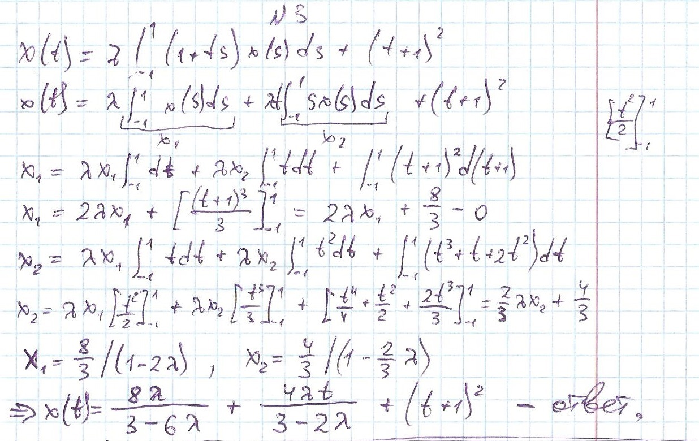
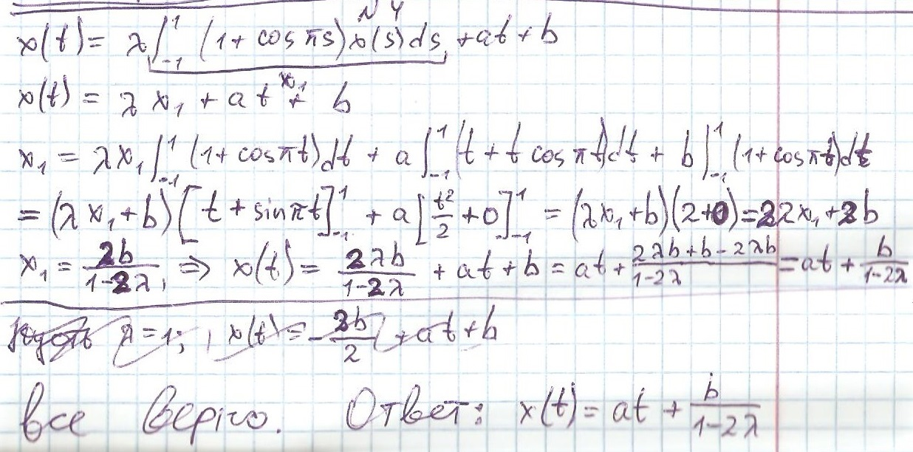
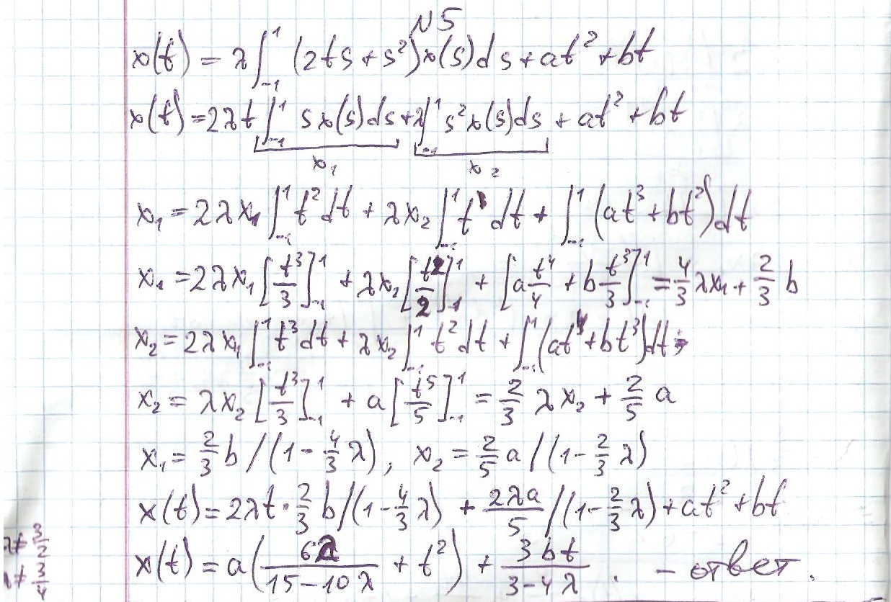
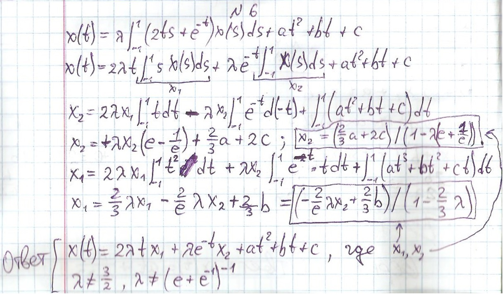

##
```
1) 1/2
2) сильная сходимость
8, 9, 11) является
10) не является
12) при любых
13) (-1; 0) U (0; 1)
14) (-∞; 0) U (0; +∞)
15) (-1; 1)
16) 3
17) 5
18) 4
```

## Task 3


## Task 4


## Task 5


## Task 6


## Ответ на 21 задачу:
```
x'' + w^2 * x = 0,
x(0)=0, 
x'(0)=C
```

## Ответ на 22-26 задачи:
```js
Math.atan       // 22
Math.sin        // 23
Math.asin       // 24
Math.cos        // 25
Math.acos       // 26
```
```html
<canvas id="plot" width="300" height="300"></canvas>
<script>
const canvas = document.getElementById("plot").getContext("2d");
canvas.beginPath();
const h=0.1, a=1, b=1, coeff=50, height=300;
for(let i=0; i<10; i+=h) canvas.lineTo(coeff*i, coeff*Math.sin(a*i+b)+height/2);
canvas.stroke();
</script>
```

## Ответ на 27 задачу по R:
```R
a <- c(0, NA, NaN, Inf, -Inf)
is.finite(a)          вернет:  TRUE FALSE FALSE FALSE FALSE
!is.infinite(a)       вернет:  TRUE  TRUE  TRUE FALSE FALSE
```
в 27 ожидаемо is.finite и is.infinite дают FALSE для NA-значений

## Ответ на 28 задачу по R:
Эта функция позволяет осуществлять "безопасное" сравнение двух Float-значений. Может принимать допустимую погрешность в качестве третьего необязательного параметра.

## Ответ на 29 задачу по R:

mean(is.na(x)) 
логично, что эта вещь вернет долю NA-значений:
```R
a <- c(0, NA, NaN, Inf, -Inf)
mean(is.na(a))
вернет:  0.4
```

sum(!is.finite(a)) 
вернет количество значений, которые дали TRUE при вызове !is.finite(a):
```R
a <- c(0, NA, NaN, Inf, -Inf)
sum(!is.finite(a)) 
вернет:  4
```

## Ответ на 30 задачу по R:
```R
x <- c(-Inf, -1, 0, 1, Inf, NA, NaN)

x[-which(x > 0)]
 вернет:  -Inf   -1    0   NA  NaN
 
x[x <= 0]
 вернет:  -Inf   -1    0   NA  NA
```

## Ответ на 31 задачу по R:
```
1 - получим NA
2 - тоже получим NA
```
